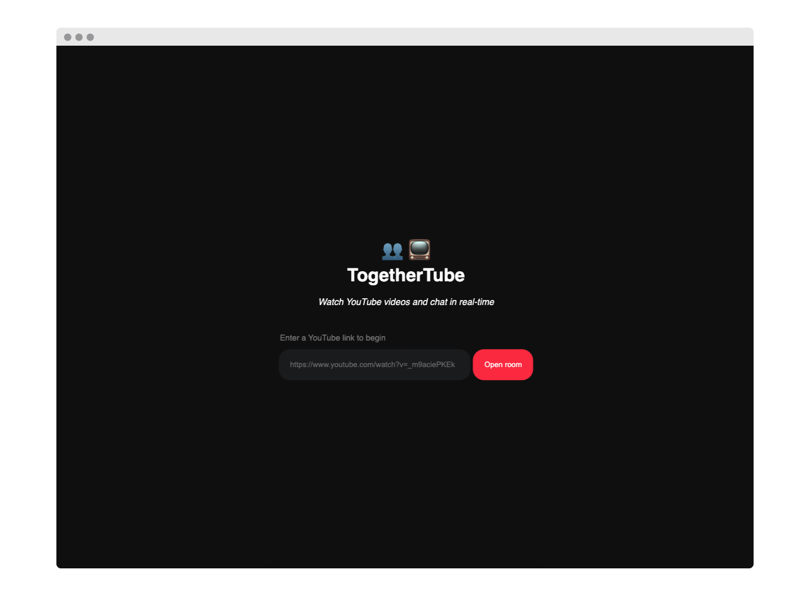
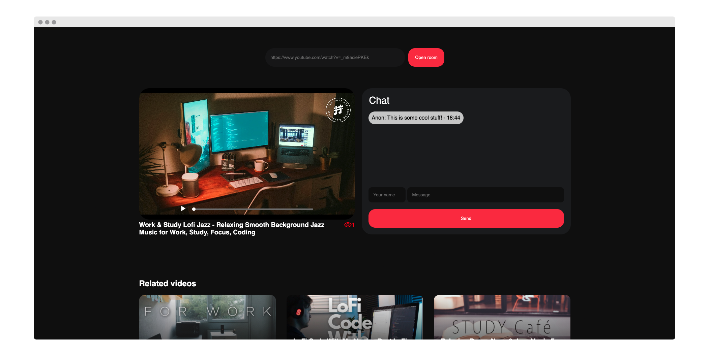
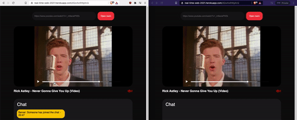
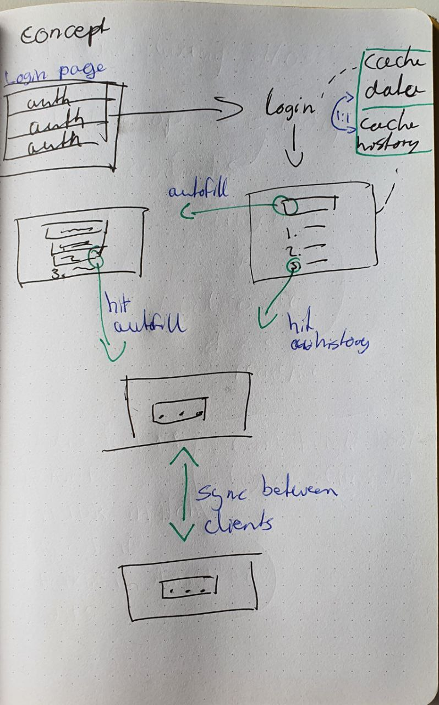
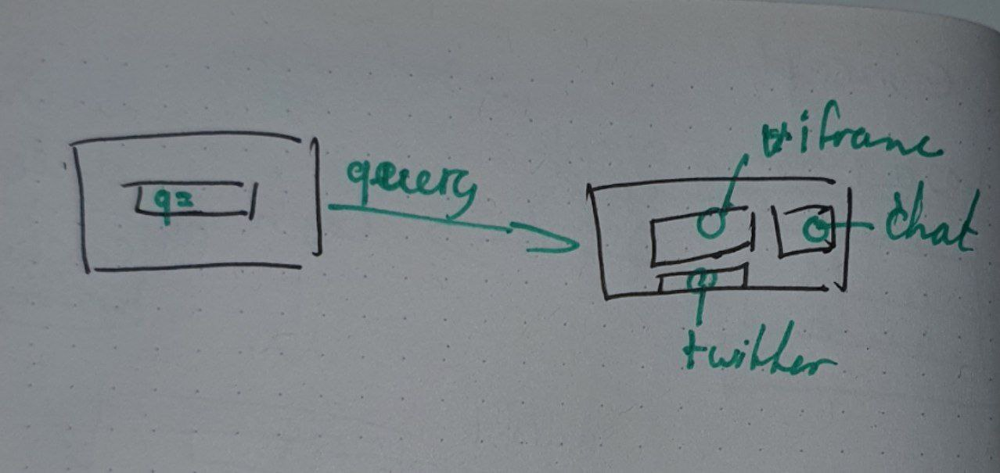
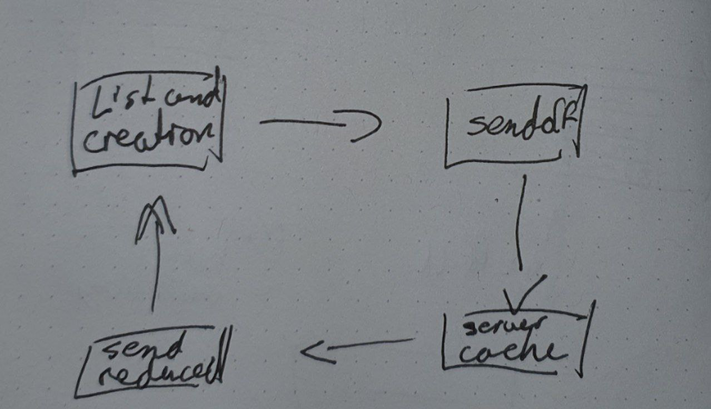
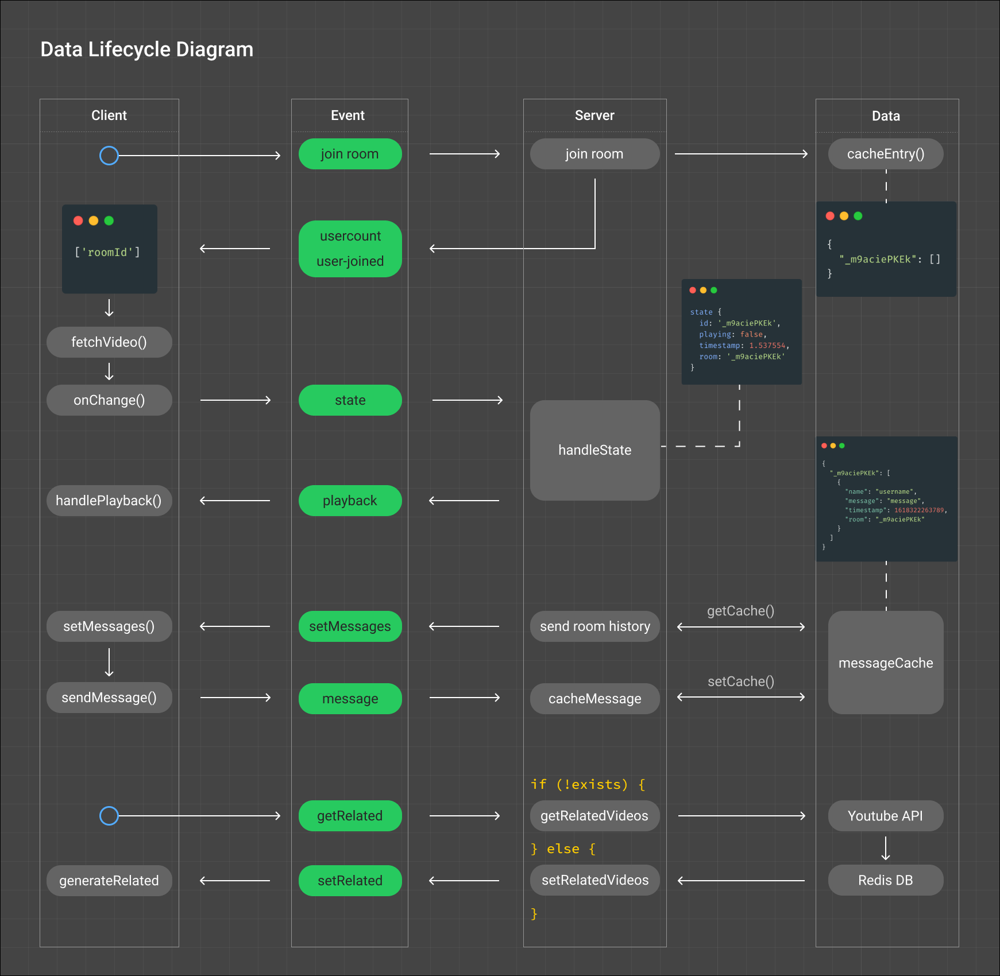

# 📺 TogetherTube

_TogetherTube is a YouTube client that brings YouTube and playback sync together!_





<table style="margin-left: auto; margin-right: auto;">
    <tr>
        <td align="center"><a href="#live-demo">💻Live demo<a></td>
        <td align="center"><a href="#the-concept">💡 The Concept<a></td>
        <td align="center"><a href="#features">📝Features <a></td>
        <td align="center"><a href="#data-lifecycle-diagram">🔄 Data lifecycle diagram<a></td>
        <td align="center"><a href="#-installation">🤖 Installation<a></td>
        <td align="center"><a href="#-sources">🤝 Sources<a></td>
        <td align="center"><a href="#-license">📝 License<a></td>
    </tr>
</table>

## 💻Live demo

[Link to the demo](https://real-time-web-2021.herokuapp.com/)

## 💡The concept

TogetherTube is a YouTube client that brings YouTube and playback sync together using Socket.io. Users can enter a YouTube URL in the search bar to open a player. On that page, they'll be greeted with the desired video along a live chat and related videos.

<details>
    <summary>Concept 1</summary>
    The first concept was similar to the final concept. Unlike the final version, it used an oauth login screen that would allow personalized rooms. The main difference was to control your other devices/tabs. After a review, it became clear that it should focus on the multi-user aspect rather than single-user&multi-device.
    
</details>

<details>
    <summary>The (final) concept </summary>
    While processing the feedback on my first concept, I decided to follow the multi-user comment. In this iteration I focussed on syncing playback and adding more multi-user features (the chat) and applied them in the concept. To improve and stimulate usage and UX, I stripped away the login and personalization such as playlists and custom rooms.
    
    Here's how the data will flow within the application.
    
</details>

## 📝Features

- Search any YouTube video
- Play any YouTube video
- Watch any YouTube video together
- Chat together on any YouTube video
- Get related videos on any YouTube video

## 🔄Data lifecycle diagram



### Real-time events
1. **State**    
The `state` event handles the seeking events sent from the client and broadcasts it to other clients. The state contains the `roomid`, `timestamp`, and `playstate`
```javascript 
{
  id: String,
  playing: Boolean,
  timestamp: Number,
  room: String
}
```
2. **Playback**    
The `playback` event handles the playback state of a give room. The array contains a room name and its playback state that is emitted to other clients connected to that room. The playback state is a boolean that plays the video on true and pauses it on false.
```javascript
{ 
  room: String, 
  state: Boolean 
}
```
3. **Message**   
The `message` event handles the sent messages from clients. The client emits a `message` event which is fetched by the server, the server caches the message using the `cacheMessage` function, and then emits the received message object to the entire room which is then rendered to in the DOM.
```JSON
{
  "roomName": [
    {
      "name": String,
      "message": String,
      "timestamp": Number,
      "room": String
    }
  ]
}
```

### Noteworthy considerations

This project has two data sources for caching the messages and related videos:

**Related cache**  
The related cache contains cached API calls from the YouTube data API. It is created when the user opens a room that has not been cached previously. The cache has the following structure:

```JSON
{
  "roomId": [
    {
        "kind": "youtube#searchResult",
        "etag": etag,
        "id": {
            "kind": string,
            "videoId": string,
            "channelId": string,
            "playlistId": string
        },
        "snippet": {
            "publishedAt": datetime,
            "channelId": string,
            "title": string,
            "description": string,
            "thumbnails": {
            (key): {
                "url": string,
                "width": unsigned integer,
                "height": unsigned integer
            }
            },
            "channelTitle": string,
            "liveBroadcastContent": string
        }
    }
  ]
}
```

While the related videos is a nice-to-have feature, it is not essential to the core functionality. Therefore, it has been decided to load the related cache in `async`. Furthermore, in consideration to the API quota limit, the cache is hosted on a remote, cloud-based Redis database. This does add some latency; the application fetches data over the internet, transforms the data, then sends it to the client over the internet.

**Messages cache**  
The messages are cached in a local JSON file called `messagesCache` with the following structure:

```JSON
{
  "roomName": [
    {
      "name": String,
      "message": String,
      "timestamp": Number,
      "room": String
  }
}
```
The chat functionality uses instant messaging therefore it is essential to fetch, save, and send data as fast as possible. That considered, it has been decided that storing messages in a local file is the preferred method.

## 🤖 Installation

**Get a YouTube API key**  
Requirements:

- Google account
- Redis database

Get your Youtube API key:

1. Open the cloud console [link](https://console.cloud.google.com/apis/dashboard)
2. Create a project
3. Open the project
4. Go to the `API Console`
5. Enable `YouTube Data API v3`
6. Copy your API key to the `.env` file in project root

Set up Redis database:

- Local:
  - Windows: [guide](https://redislabs.com/blog/redis-on-windows-10/)
  - MacOS using `homebrew`: `brew install redis`
  - Unix using buildtools: [download binary](https://redis.io/download)
- Cloud (preferred method)
  1. Create an account at [RedisLabs](https://redislabs.com/try-free/)
  2. Copy credentials to the `.env` in project root

**Run the project:**

1. Install dependencies
   `npm install`
2. Run project
   `npm start`

## 🤝 Sources

- [Youtube Data API v3](https://developers.google.com/youtube/v3)
- [Youtube Data API v3 - Search](https://developers.google.com/youtube/v3/docs/search)
- [Socket.io v4 - Documentation](https://socket.io/docs/v4)
- [Async-Redis - Documentation](https://www.npmjs.com/package/async-redis)

## 📝 License

[GPLv3](https://choosealicense.com/licenses/gpl-3.0/)


